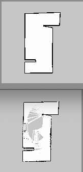

# Voronoi Multi_Robot Collaborate Exploration

## Introduction
In the unknown environment, the cooperative exploration of multiple robots is completed by Voronoi partition and deep reinforcement learning. The decision-making level assigns different target positions to each mobile robot through Voronoi  partition and point selection formula to minimize repeated exploration; The path planning layer uses the method based on deep reinforcement learning to make each mobile robot reach the corresponding target position without collision.

## Enviroment
| parameter   |  description  |
| ----  | ----  |
| system| Ubuntu18.04 ; ROS(Melodic); Phython 2.7|
| simulator | Gazebo|
| display |Rviz|
| simulation car | Turtlebot3(Waffle)|
|senor | LiDAR |
| laser range | 0.1 - 3.5 m |
| angle range | -90 - 90|
| laser numer  | 24 |

## Run
### dependency package
```
sudo apt-get install ros-melodic-joy ros-melodic-teleop-twist-joy ros-melodic-teleop-twist-keyboard ros-melodic-laser-proc ros-melodic-rgbd-launch ros-melodic-depthimage-to-laserscan ros-melodic-rosserial-arduino ros-melodic-rosserial-python ros-melodic-rosserial-server ros-melodic-rosserial-client ros-melodic-rosserial-msgs ros-melodic-amcl ros-melodic-map-server ros-melodic-move-base ros-melodic-urdf ros-melodic-xacro ros-melodic-compressed-image-transport ros-melodic-rqt-image-view ros-melodic-gmapping ros-melodic-navigation ros-melodic-interactive-markers ros-melodic-multirobot-map-merge
```
Add
```
pyyaml、rospkg、pytorch、torchvision、tensorflow 、tensorboard、mpi4py、joblib、gym、pathlib、wandb、Image、setproctitle、imageio
```
### compile & run
```
> catkin_make 
> source devel/setup.bash
> roslaunch multi_turtlebot3_expore three_turtlebot3_gmapping.launch
> python ddpg_test.py
```
### test
#### Move & mapping

Comparison of construction effects

#### Run in other environments

Avoid obstacle

## Reference 
- hanlinniu/turtlebot3_ddpg_collision_avoidance：https://github.com/hanlinniu/turtlebot3_ddpg_collision_avoidance